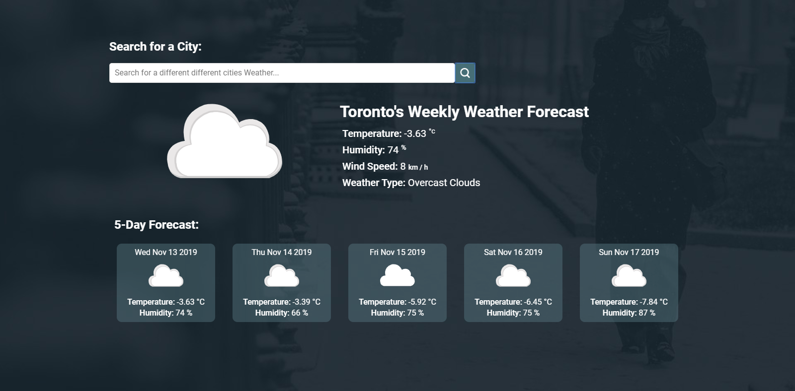

# React OpenWeather

This is a react weather application built using openweather API data. 
Live Link: https://openweather-react.netlify.com

This project was bootstrapped with [Create React App](https://github.com/facebook/create-react-app).

## To run on your local computer

Run the following commands in the terminal inside the project folder.

### `npm install`

This will install the dependencies for the react app to run. 

### `npm start`

Runs the app in the development mode. 
Open [http://localhost:3000](http://localhost:3000) to view it in the browser.

The page will reload if you make edits. 
